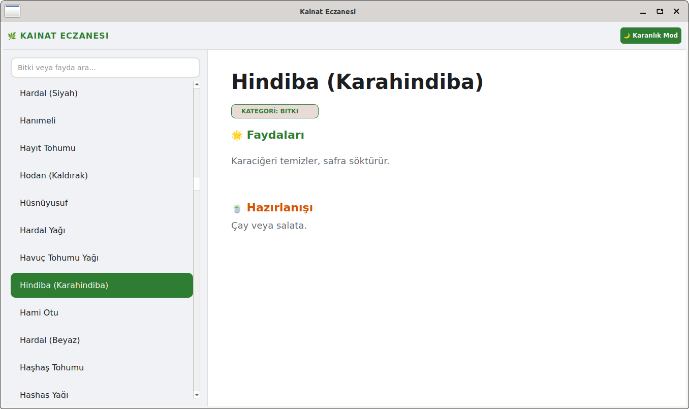

# Kainat Eczanesi

Bu uygulama A dan Z ye tam 1200 adet bitkiye ait bilgi içerir.

⚠️ Önemli Yasal Uyarı (Medical Disclaimer)

Bu uygulama tıbbi bir tavsiye niteliği taşımaz. Uygulama içerisinde sunulan tüm bilgiler (bitki faydaları, kullanım şekilleri vb.) sadece bilgilendirme amaçlıdır ve geleneksel kullanım verilerinden derlenmiştir. Bu bilgilerin doğruluğu, eksiksizliği veya güncelliği konusunda bir garanti verilmemektedir.

Lütfen aşağıdaki maddeleri dikkatle okuyunuz:

Teşhis ve Tedavi: Herhangi bir sağlık sorununuz için mutlaka profesyonel bir tıp doktoruna başvurunuz. Bu uygulamadaki bilgileri bir doktorun teşhisi veya tedavisi yerine kullanmayınız.

Kronik Hastalıklar ve İlaç Etkileşimi: Düzenli ilaç kullanıyorsanız, kronik bir rahatsızlığınız (tansiyon, şeker, kalp vb.) varsa veya hamilelik/emzirme dönemindeyseniz, herhangi bir bitkisel yöntemi denemeden önce mutlaka doktorunuza danışınız. Bitkiler, kullandığınız ilaçlarla ciddi etkileşimlere girebilir.

Alerjik Reaksiyonlar: Doğal olan her şey her zaman "güvenli" demek değildir. Bazı bitkiler şiddetli alerjik reaksiyonlara veya yan etkilere yol açabilir.

Sorumluluk Reddi: Uygulamanın kullanımından doğabilecek herhangi bir yan etki, sağlık sorunu veya olumsuz durumdan uygulama geliştiricisi sorumlu tutulamaz.

Debian tabanlı sistemler için .deb dosyası indirme linki: https://github.com/03tekno/kainat-eczanesi/raw/refs/heads/main/kainat-eczanesi_1.0.0.deb

